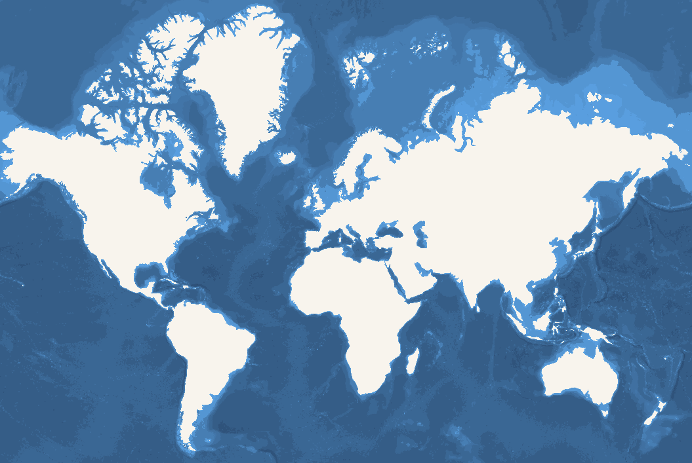

# OpenDEM GEBCO Bathymetry



> *This is very much experimental at this stage. Things might change without notice. Do not use in production*

Convert [Bathymetry Shapefiles from OpenDEM](https://www.opendem.info/download_bathymetry.html) to Vectortiles in a [Versatiles Container](https://versatiles.org/).

## Depths

| Zoom | Depths |
| ---- | ------ |
| 0-5  | 100, 500, 2000, 6000, 8000
| 6-9  | 50, 100, 200, 500, 1000, 1500, 2000, 3000, 4000, 5000, 6000, 7000, 8000, 9000
| 10   | 25, 50, 100, 200, 250, 500, 750, 1000, 1250, 1500, 1750, 2000, 2500, 3000, 3500, 4000, 4500, 5000, 5500, 6000, 6500, 7000, 7500, 8000, 8500, 9000, 9500

## Run

`sh run.sh`

## Requirementrs

* `curl`
* `gdal`
* `node` or `bun`
* `tippecanoe`
* `mapshaper`
* `sqlite3`
* `jq`
* `versatiles`

## Style application

Example:

``` js
{
	"id": "bathymetry-gebco-opendem",
	"type": "fill",
	"source": "bathymetry-gebco-opendem",
	"source-layer": "bathymetry",
	"layout": {
		"visibility": "visible"
	},
	"paint": {
		"fill-opacity": 1.
		"fill-antialias": false,
		"fill-color": ["case",
			["==", ["get", "mindepth"], -25], "#0084bd",
			["==", ["get", "mindepth"], -50], "#0181ba",
			["==", ["get", "mindepth"], -100], "#017fb6",
			["==", ["get", "mindepth"], -200], "#027cb3",
			["==", ["get", "mindepth"], -250], "#0279af",
			["==", ["get", "mindepth"], -500], "#0276ac",
			["==", ["get", "mindepth"], -750], "#0374a8",
			["==", ["get", "mindepth"], -1000], "#0371a5",
			["==", ["get", "mindepth"], -1250], "#036ea1",
			["==", ["get", "mindepth"], -1500], "#036c9e",
			["==", ["get", "mindepth"], -1750], "#03699b",
			["==", ["get", "mindepth"], -2000], "#036797",
			["==", ["get", "mindepth"], -2500], "#036494",
			["==", ["get", "mindepth"], -3000], "#036191",
			["==", ["get", "mindepth"], -3500], "#035f8d",
			["==", ["get", "mindepth"], -4000], "#035c8a",
			["==", ["get", "mindepth"], -4500], "#035a87",
			["==", ["get", "mindepth"], -5000], "#025783",
			["==", ["get", "mindepth"], -5500], "#025580",
			["==", ["get", "mindepth"], -6000], "#02527d",
			["==", ["get", "mindepth"], -6500], "#025079",
			["==", ["get", "mindepth"], -7000], "#014d76",
			["==", ["get", "mindepth"], -7500], "#014b73",
			["==", ["get", "mindepth"], -8000], "#014870",
			["==", ["get", "mindepth"], -8500], "#01466c",
			["==", ["get", "mindepth"], -9000], "#004369",
			["==", ["get", "mindepth"], -9500], "#004166",
			"#0097d6"
		]
	}
}
```
